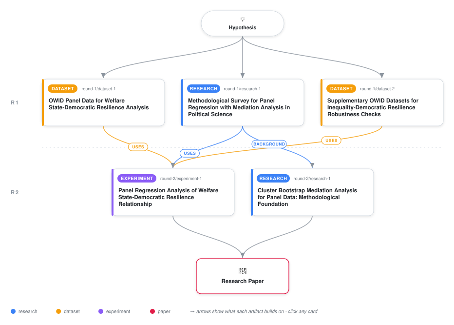

# Welfare State Generosity and the Inequality-Democratic Resilience Relationship: Evidence from Post-1990 Democratizers

<div align="center">

<a href="https://cdn.jsdelivr.net/gh/AMGrobelnik/ai-invention-f1091c-welfare-state-generosity-and-the-inequal@main/workflow.svg">
<picture>
  <source media="(prefers-color-scheme: dark)" srcset="workflow-dark.svg">
  
</picture>
</a>

<sub>🖱️ <b><a href="https://cdn.jsdelivr.net/gh/AMGrobelnik/ai-invention-f1091c-welfare-state-generosity-and-the-inequal@main/workflow.svg">Open the interactive diagram</a></b> — every card links to its artifact folder.</sub>

</div>

> **TL;DR** — This paper investigates the association between welfare state generosity and the inequality-democratic resilience relationship in post-1990 democratizers, addressing major methodological limitations from prior work including missing data (74% for welfare spending), endogeneity concerns, and cluster bootstrap inference for mediation analysis.

<details>
<summary>Full hypothesis</summary>

In post-1990 democratizers, the relationship between income inequality (Gini coefficient) and democratic resilience (V-Dem electoral democracy index) varies across countries, but the direction and magnitude of welfare state generosity's association with this relationship is sensitive to model specification, missing data assumptions, and regional heterogeneity. Descriptive analysis reveals that higher inequality is associated with LOWER (not higher) welfare spending, contradicting standard demand-for-redistribution theory and suggesting reverse causality or different political economy in new democracies. The paper reports exploratory associations rather than causal effects, with 74% missing data for social spending and potential sign inconsistencies in the mediation pathway requiring further investigation before strong conclusions can be drawn.

</details>

[](https://cdn.jsdelivr.net/gh/AMGrobelnik/ai-invention-f1091c-welfare-state-generosity-and-the-inequal@main/paper.pdf) [](https://github.com/AMGrobelnik/ai-invention-f1091c-welfare-state-generosity-and-the-inequal/tree/main/paper_latex)

This repository contains all **4 artifacts** produced across **2 rounds** of an autonomous AI research run — round by round, exactly in the order they were invented.

## Round 1

| Artifact | Type | Demo | Source | Builds on |
|----------|------|------|--------|-----------|
| **[Methodological Survey for Panel Regression with Mediation An…](https://github.com/AMGrobelnik/ai-invention-f1091c-welfare-state-generosity-and-the-inequal/tree/main/round-1/research-1)** | [](https://github.com/AMGrobelnik/ai-invention-f1091c-welfare-state-generosity-and-the-inequal/tree/main/round-1/research-1) | [](https://github.com/AMGrobelnik/ai-invention-f1091c-welfare-state-generosity-and-the-inequal/blob/main/round-1/research-1/demo/research_demo.md) | [](https://github.com/AMGrobelnik/ai-invention-f1091c-welfare-state-generosity-and-the-inequal/tree/main/round-1/research-1/src) | — |
| **[Supplementary OWID Datasets for Inequality-Democratic Resili…](https://github.com/AMGrobelnik/ai-invention-f1091c-welfare-state-generosity-and-the-inequal/tree/main/round-1/dataset-2)** | [](https://github.com/AMGrobelnik/ai-invention-f1091c-welfare-state-generosity-and-the-inequal/tree/main/round-1/dataset-2) | [](https://colab.research.google.com/github/AMGrobelnik/ai-invention-f1091c-welfare-state-generosity-and-the-inequal/blob/main/round-1/dataset-2/demo/data_code_demo.ipynb) | [](https://github.com/AMGrobelnik/ai-invention-f1091c-welfare-state-generosity-and-the-inequal/tree/main/round-1/dataset-2/src) | — |

## Round 2

| Artifact | Type | Demo | Source | Builds on |
|----------|------|------|--------|-----------|
| **[Cluster Bootstrap Mediation Analysis for Panel Data: Methodo…](https://github.com/AMGrobelnik/ai-invention-f1091c-welfare-state-generosity-and-the-inequal/tree/main/round-2/research-1)** | [](https://github.com/AMGrobelnik/ai-invention-f1091c-welfare-state-generosity-and-the-inequal/tree/main/round-2/research-1) | [](https://github.com/AMGrobelnik/ai-invention-f1091c-welfare-state-generosity-and-the-inequal/blob/main/round-2/research-1/demo/research_demo.md) | [](https://github.com/AMGrobelnik/ai-invention-f1091c-welfare-state-generosity-and-the-inequal/tree/main/round-2/research-1/src) | <sub><i>background:</i><br/>[research‑1&nbsp;(R1)](https://github.com/AMGrobelnik/ai-invention-f1091c-welfare-state-generosity-and-the-inequal/tree/main/round-1/research-1)</sub> |
| **[Panel Regression Analysis of Welfare State-Democratic Resili…](https://github.com/AMGrobelnik/ai-invention-f1091c-welfare-state-generosity-and-the-inequal/tree/main/round-2/experiment-1)** | [](https://github.com/AMGrobelnik/ai-invention-f1091c-welfare-state-generosity-and-the-inequal/tree/main/round-2/experiment-1) | [](https://colab.research.google.com/github/AMGrobelnik/ai-invention-f1091c-welfare-state-generosity-and-the-inequal/blob/main/round-2/experiment-1/demo/method_code_demo.ipynb) | [](https://github.com/AMGrobelnik/ai-invention-f1091c-welfare-state-generosity-and-the-inequal/tree/main/round-2/experiment-1/src) | <sub><i>uses:</i><br/>[dataset‑1&nbsp;(R1)](https://github.com/AMGrobelnik/ai-invention-f1091c-welfare-state-generosity-and-the-inequal/tree/main/round-1/dataset-1)<br/>[dataset‑2&nbsp;(R1)](https://github.com/AMGrobelnik/ai-invention-f1091c-welfare-state-generosity-and-the-inequal/tree/main/round-1/dataset-2)<br/>[research‑1&nbsp;(R1)](https://github.com/AMGrobelnik/ai-invention-f1091c-welfare-state-generosity-and-the-inequal/tree/main/round-1/research-1)</sub> |

## Repository Structure

Artifacts are grouped by the round of invention that produced them. Each
artifact has its own folder with source code and a self-contained demo:

```
.
├── round-1/                         # One folder per round of invention
│   ├── experiment-1/
│   │   ├── README.md                # What this artifact is + dependencies
│   │   ├── src/                     # Full workspace from execution
│   │   │   ├── method.py            # Main implementation
│   │   │   ├── method_out.json      # Full output data
│   │   │   └── ...                  # All execution artifacts
│   │   └── demo/                    # Self-contained demo
│   │       └── method_code_demo.ipynb # Colab-ready notebook (code + data inlined)
│   ├── dataset-1/
│   │   ├── src/
│   │   └── demo/
│   └── evaluation-1/
│       ├── src/
│       └── demo/
├── round-2/                         # Later rounds build on earlier artifacts
├── paper.pdf                        # Research paper
├── paper_latex/                     # LaTeX source files
├── workflow.svg                     # Artifact dependency diagram (this page's header)
└── README.md
```

## Running Notebooks

### Option 1: Google Colab (Recommended)

Click the "Open in Colab" badges above to run notebooks directly in your browser.
No installation required!

### Option 2: Local Jupyter

```bash
# Clone the repo
git clone https://github.com/AMGrobelnik/ai-invention-f1091c-welfare-state-generosity-and-the-inequal
cd ai-invention-f1091c-welfare-state-generosity-and-the-inequal

# Install dependencies
pip install jupyter

# Run any artifact's demo notebook
jupyter notebook <artifact_folder>/demo/
```

## Source Code

The original source files are in each artifact's `src/` folder.
These files may have external dependencies - use the demo notebooks for a self-contained experience.

---
*Generated by AI Inventor Pipeline - Automated Research Generation*
